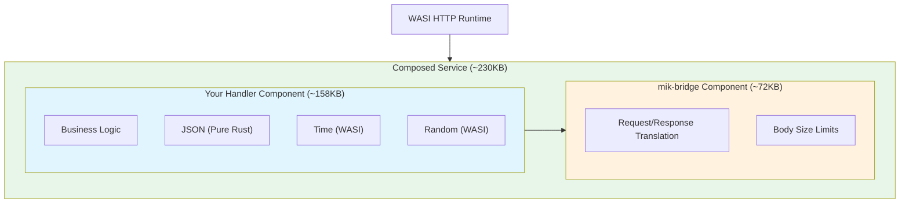
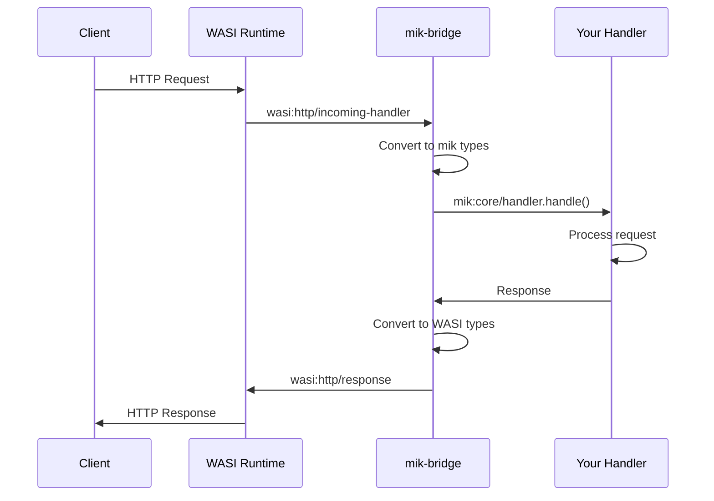
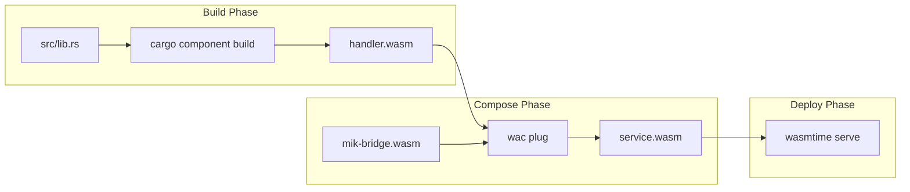
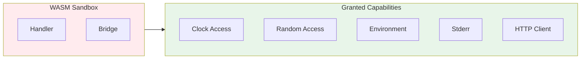

import { Aside, Tabs, TabItem } from '@astrojs/starlight/components';

mik-sdk uses a two-component architecture for WASI HTTP portability. This guide explains how the components work together.

## Overview



## Component Roles

### Handler Component

Your handler contains:

| Module | Implementation | Purpose |
|--------|----------------|---------|
| **Business Logic** | Your code | Request handling, validation, business rules |
| **JSON** | Pure Rust | Parsing and building JSON (no WASI calls) |
| **Time** | `wasi:clocks/wall-clock` | UTC timestamps, ISO 8601 |
| **Random** | `wasi:random/random` | UUIDs, tokens, secure random |
| **HTTP Client** | `wasi:http/outgoing-handler` | Outbound requests (optional) |

The handler exports the `mik:core/handler` interface.

### Bridge Component

The bridge handles WASI HTTP translation:

- Imports `mik:core/handler` (your handler)
- Exports `wasi:http/incoming-handler` (standard WASI HTTP)
- Converts between WASI HTTP types and mik types
- Enforces body size limits (configurable via `MIK_MAX_BODY_SIZE`)

### Composed Service

The two components are composed using WAC:

```bash
wac plug mik-bridge.wasm --plug handler.wasm -o service.wasm
```

The resulting component:
- Exports `wasi:http/incoming-handler`
- Can run on any WASI HTTP runtime
- Size: ~230KB (release build)

## Interface Definition

The handler interface is defined in WIT:

```wit
package mik:core@0.1.0;

interface handler {
    enum method { get, post, put, patch, delete, head, options }

    record request-data {
        method: method,
        path: string,
        headers: list<tuple<string, string>>,
        body: option<list<u8>>,
    }

    record response {
        status: u16,
        headers: list<tuple<string, string>>,
        body: option<list<u8>>,
    }

    handle: func(req: request-data) -> response;
}

world handler-world {
    import wasi:clocks/wall-clock@0.2.0;
    import wasi:random/random@0.2.0;
    import wasi:cli/environment@0.2.0;
    import wasi:cli/stderr@0.2.0;

    export handler;
}
```

## Request Flow



## Build Process



### Build Commands

```bash
# Build your handler
cargo component build --release

# Compose with bridge
wac plug mik-bridge.wasm \
    --plug target/wasm32-wasip2/release/my_handler.wasm \
    -o service.wasm

# Run
wasmtime serve -S cli=y service.wasm
```

## Component Sizes

| Component | Debug | Release |
|-----------|-------|---------|
| Handler (basic) | ~500KB | ~158KB |
| Handler (with http-client) | ~700KB | ~236KB |
| Bridge | ~100KB | ~72KB |
| Composed (basic) | ~600KB | ~230KB |
| Composed (http-client) | ~800KB | ~308KB |

### Optimization Tips

1. **Use release builds:** `cargo component build --release`

2. **Enable LTO:**
   ```toml
   [profile.release]
   lto = true
   ```

3. **Disable unused features:**
   ```toml
   mik-sdk = { version = "0.1", default-features = false }
   ```

## WASI Imports

The handler component imports these WASI interfaces:

| Interface | Purpose | Used By |
|-----------|---------|---------|
| `wasi:clocks/wall-clock` | Current time | `time::now()`, `time::now_iso()` |
| `wasi:random/random` | Secure random | `random::uuid()`, `random::bytes()` |
| `wasi:cli/environment` | Environment vars | `env::get()`, `env::require()` |
| `wasi:cli/stderr` | Logging output | `log::info!()`, `log!()` |
| `wasi:http/outgoing-handler` | HTTP client | `fetch!().send()` (optional) |

## Pure Rust Modules

These modules require no WASI calls:

| Module | Description |
|--------|-------------|
| `json` | JSON parsing and building |
| `request` | Request wrapper and parsing |
| `typed` | Derive macro implementations |
| `query` | SQL query builder |

This design means JSON operations are fast and don't cross the component boundary.

## Portability

The composed component runs on any WASI HTTP runtime:

| Runtime | Command |
|---------|---------|
| wasmtime | `wasmtime serve -S cli=y service.wasm` |

<Aside type="note">
The `-S cli=y` flag enables stdio support for logging.
</Aside>

## Security Boundaries



The WASM sandbox provides:
- **Memory isolation:** No access to host memory
- **Capability-based security:** Only granted WASI interfaces
- **No filesystem access:** By default (unless granted)
- **Controlled networking:** Only via `wasi:http`

## Next Steps

- [Installation](/guides/installation/) - Set up your environment
- [Quick Start](/guides/quickstart/) - Build your first handler
- [Routing](/guides/routing/) - Learn the routing system
