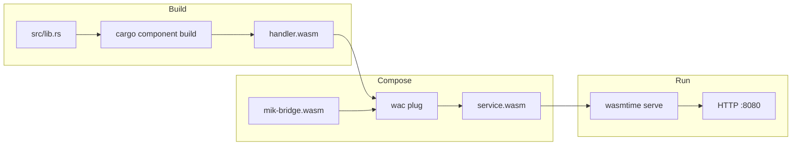

import { Steps, Code, Aside, Tabs, TabItem } from '@astrojs/starlight/components';

Build a complete HTTP handler in minutes. This guide covers the essential patterns you'll use in every mik-sdk project.

## Your First Handler

<Steps>

1. **Create the project structure**

   ```bash
   cargo new --lib hello-handler
   cd hello-handler
   ```

2. **Configure Cargo.toml**

   ```toml
   [package]
   name = "hello-handler"
   version = "0.1.0"
   edition = "2024"

   [lib]
   crate-type = ["cdylib"]

   [dependencies]
   mik-sdk = "0.1"

   [package.metadata.component]
   package = "hello:handler"

   [package.metadata.component.target.dependencies]
   "mik:core" = { path = "wit/deps/core" }
   ```

3. **Add WIT files**

   Copy the `wit/` directory from `examples/hello-world/` in the mik-sdk repository.

4. **Write your handler**

   ```rust
   // src/lib.rs
   #[allow(warnings)]
   mod bindings;

   use bindings::exports::mik::core::handler::{self, Guest, Response};
   use mik_sdk::prelude::*;

   // Define input types
   #[derive(Path)]
   pub struct HelloPath {
       pub name: String,
   }

   #[derive(Type)]
   pub struct HelloResponse {
       pub greeting: String,
   }

   // Define routes
   routes! {
       GET "/" => home,
       GET "/hello/{name}" => hello(path: HelloPath) -> HelloResponse,
   }

   // Implement handlers
   fn home(_req: &Request) -> Response {
       ok!({
           "message": "Welcome to mik-sdk!",
           "endpoints": ["/", "/hello/{name}"]
       })
   }

   fn hello(path: HelloPath, _req: &Request) -> Response {
       ok!({
           "greeting": format!("Hello, {}!", path.name)
       })
   }
   ```

5. **Build the component**

   ```bash
   cargo component build --release
   ```

6. **Compose with the bridge**

   ```bash
   wac plug mik-bridge.wasm \
       --plug target/wasm32-wasip2/release/hello_handler.wasm \
       -o service.wasm
   ```

7. **Run locally**

   ```bash
   wasmtime serve -S cli=y service.wasm
   ```

8. **Test your handler**

   ```bash
   curl http://localhost:8080/
   curl http://localhost:8080/hello/World
   ```

</Steps>

## Understanding the Code

### Bindings Module

```rust
#[allow(warnings)]
mod bindings;
```

The `bindings` module is generated by `cargo-component` from your WIT files. It provides the typed interface for your handler.

### Derive Macros

```rust
#[derive(Path)]
pub struct HelloPath {
    pub name: String,  // Matches {name} in the route
}

#[derive(Type)]
pub struct HelloResponse {
    pub greeting: String,
}
```

| Macro | Purpose |
|-------|---------|
| `#[derive(Type)]` | JSON request/response body |
| `#[derive(Path)]` | URL path parameters |
| `#[derive(Query)]` | Query string parameters |

### Routes Definition

```rust
routes! {
    GET "/" => home,
    GET "/hello/{name}" => hello(path: HelloPath) -> HelloResponse,
}
```

The `routes!` macro:
- Maps HTTP methods and paths to handler functions
- Extracts typed inputs (path, query, body)
- Generates the `Guest` implementation
- Auto-registers a `/__schema` endpoint for OpenAPI

### Handler Functions

```rust
fn hello(path: HelloPath, _req: &Request) -> Response {
    ok!({ "greeting": format!("Hello, {}!", path.name) })
}
```

Handlers receive:
- Typed inputs (path, query, body) - already parsed and validated
- The raw `&Request` for accessing headers, raw body, etc.

## Adding More Features

### Query Parameters

```rust
#[derive(Query)]
pub struct SearchQuery {
    pub q: Option<String>,
    #[field(default = 1)]
    pub page: u32,
    #[field(default = 20, max = 100)]
    pub limit: u32,
}

routes! {
    GET "/search" => search(query: SearchQuery),
}

fn search(query: SearchQuery, _req: &Request) -> Response {
    ok!({
        "query": query.q,
        "page": query.page,
        "limit": query.limit
    })
}
```

### Request Body

```rust
#[derive(Type)]
pub struct CreateUserInput {
    #[field(min = 1, max = 100)]
    pub name: String,
    pub email: String,
}

routes! {
    POST "/users" => create_user(body: CreateUserInput),
}

fn create_user(body: CreateUserInput, _req: &Request) -> Response {
    // body is already parsed and validated
    let id = random::uuid();
    created!(format!("/users/{}", id), {
        "id": id,
        "name": body.name,
        "email": body.email
    })
}
```

### Error Responses

```rust
fn get_user(path: Id, _req: &Request) -> Response {
    let user_id = path.as_str();

    // Guard macro for validation
    guard!(!user_id.is_empty(), 400, "User ID required");

    // Ensure macro for Option/Result
    let user = ensure!(find_user(user_id), 404, "User not found");

    ok!({ "user": user })
}
```

## Component Architecture



## Next Steps

- [Routing](/guides/routing/) - Deep dive into the routing system
- [Request](/reference/request/) - Access headers, body, and more
- [Responses](/reference/responses/) - All response macros
- [Examples](/examples/basic/) - Complete working examples
