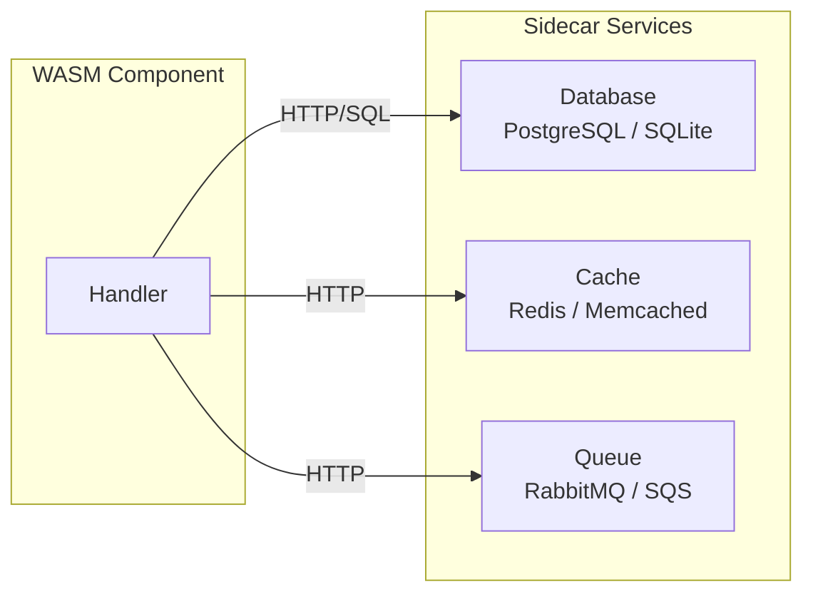

import { Aside, Tabs, TabItem } from '@astrojs/starlight/components';

mik-sdk handlers are designed to work with external services for data storage, caching, and other infrastructure concerns. This guide covers patterns for integrating with these services.

## Architecture Overview



## SQL Query Builder

mik-sdk includes a SQL query builder for generating parameterized queries. The queries are executed by your sidecar database service.

### Basic CRUD Operations

```rust
use mik_sdk::prelude::*;

// SELECT
let (sql, params) = sql_read!(users {
    select: [id, name, email, created_at],
    filter: { active: true },
    order: name,
    limit: 20,
});
// sql: SELECT id, name, email, created_at FROM users WHERE active = $1 ORDER BY name LIMIT 20
// params: [Value::Bool(true)]

// INSERT
let (sql, params) = sql_create!(users {
    name: "Alice",
    email: "alice@example.com",
    returning: [id, created_at],
});
// sql: INSERT INTO users (name, email) VALUES ($1, $2) RETURNING id, created_at

// UPDATE
let (sql, params) = sql_update!(users {
    set: { name: "Bob" },
    filter: { id: 123 },
});
// sql: UPDATE users SET name = $1 WHERE id = $2

// DELETE
let (sql, params) = sql_delete!(users {
    filter: { id: 123 },
});
// sql: DELETE FROM users WHERE id = $1
```

### Filter Operators

```rust
// Comparison operators
sql_read!(users {
    filter: {
        age: { $gte: 18 },        // age >= 18
        status: { $ne: "banned" }, // status != 'banned'
        score: { $lt: 100 },       // score < 100
    },
});

// List operators
sql_read!(users {
    filter: {
        role: { $in: ["admin", "moderator"] },
        id: { $nin: [1, 2, 3] },
    },
});

// Text operators
sql_read!(users {
    filter: {
        name: { $like: "%alice%" },
        email: { $ends_with: "@example.com" },
        bio: { $contains: "developer" },
    },
});

// Logical operators
sql_read!(users {
    filter: {
        $or: [
            { role: "admin" },
            { verified: true }
        ]
    },
});
```

| Operator | SQL | Example |
|----------|-----|---------|
| `$eq` | `=` | `{ age: { $eq: 18 } }` |
| `$ne` | `!=` | `{ status: { $ne: "banned" } }` |
| `$gt` | `>` | `{ score: { $gt: 100 } }` |
| `$gte` | `>=` | `{ age: { $gte: 18 } }` |
| `$lt` | `<` | `{ score: { $lt: 50 } }` |
| `$lte` | `<=` | `{ age: { $lte: 65 } }` |
| `$in` | `IN` | `{ id: { $in: [1, 2, 3] } }` |
| `$nin` | `NOT IN` | `{ id: { $nin: [1, 2, 3] } }` |
| `$like` | `LIKE` | `{ name: { $like: "%alice%" } }` |
| `$starts_with` | `LIKE 'x%'` | `{ name: { $starts_with: "A" } }` |
| `$ends_with` | `LIKE '%x'` | `{ email: { $ends_with: ".com" } }` |
| `$contains` | `LIKE '%x%'` | `{ bio: { $contains: "rust" } }` |
| `$between` | `BETWEEN` | `{ age: { $between: [18, 65] } }` |

### Ordering

```rust
sql_read!(posts {
    select: [id, title, created_at],
    order: [-created_at, id],  // DESC created_at, ASC id
});
```

Prefix with `-` for descending order.

### Pagination

<Tabs>
<TabItem label="Offset Pagination">

```rust
#[derive(Query)]
pub struct PageQuery {
    #[field(default = 1)]
    pub page: u32,
    #[field(default = 20, max = 100)]
    pub limit: u32,
}

fn list_users(query: PageQuery, _req: &Request) -> Response {
    let (sql, params) = sql_read!(users {
        select: [id, name],
        order: id,
        page: query.page,
        limit: query.limit,
    });

    // Execute query via sidecar...
    ok!({ "sql": sql })
}
```

</TabItem>
<TabItem label="Cursor Pagination">

```rust
use mik_sdk::query::Cursor;

fn list_posts(query: ListQuery, _req: &Request) -> Response {
    let (sql, params) = sql_read!(posts {
        select: [id, title, created_at],
        filter: { published: true },
        order: [-created_at, -id],
        after: query.cursor.as_deref(),
        limit: 20,
    });

    // Execute query, get results...
    // let posts = execute_query(sql, params);

    // Build next cursor from last item
    // let next_cursor = if let Some(last) = posts.last() {
    //     Some(Cursor::new()
    //         .string("created_at", &last.created_at)
    //         .int("id", last.id)
    //         .encode())
    // } else {
    //     None
    // };

    ok!({ "sql": sql })
}
```

</TabItem>
</Tabs>

### SQLite Dialect

For SQLite, add `sqlite` as the first parameter:

```rust
let (sql, params) = sql_read!(sqlite, users {
    filter: { active: true },
});
// Uses ?1, ?2 placeholders instead of $1, $2
```

## HTTP Client for Services

Enable the `http-client` feature to call external services:

```toml
[dependencies]
mik-sdk = { version = "0.1", features = ["http-client"] }
```

### Calling a Database Proxy

```rust
use mik_sdk::prelude::*;

fn list_users(_req: &Request) -> Response {
    let (sql, params) = sql_read!(users {
        select: [id, name, email],
        limit: 20,
    });

    // Call database proxy sidecar
    let response = fetch!(POST "http://db-proxy:8080/query", json: {
        "sql": sql,
        "params": params
    }).send()?;

    if response.is_success() {
        let body = response.body();
        // Parse and return results
        ok!({ "data": json::try_parse(&body) })
    } else {
        error! {
            status: 500,
            title: "Database Error",
            detail: "Failed to execute query"
        }
    }
}
```

### Calling a Cache Service

```rust
fn get_user(path: Id, _req: &Request) -> Response {
    let user_id = path.as_str();

    // Try cache first
    let cache_response = fetch!(GET format!("http://cache:8080/users/{}", user_id))
        .send()
        .ok();

    if let Some(resp) = cache_response {
        if resp.is_success() {
            // Return cached data
            return ok!({ "data": json::try_parse(&resp.body()), "cached": true });
        }
    }

    // Cache miss - fetch from database
    let db_response = fetch!(GET format!("http://db-proxy:8080/users/{}", user_id))
        .send()?;

    if db_response.is_success() {
        // Store in cache (fire and forget)
        let _ = fetch!(PUT format!("http://cache:8080/users/{}", user_id),
            body: db_response.body()
        ).send();

        ok!({ "data": json::try_parse(&db_response.body()), "cached": false })
    } else {
        not_found!("User not found")
    }
}
```

## Batched Loading

Use the `ids!` macro to extract IDs for batched queries:

```rust
fn list_posts_with_authors(_req: &Request) -> Response {
    // Get posts
    let (sql, params) = sql_read!(posts {
        select: [id, title, author_id],
        limit: 20,
    });
    // let posts = execute_query(sql, params);

    // Extract author IDs for batched loading
    // let author_ids = ids!(posts, author_id);

    // Batch load authors (single query, no N+1)
    // let (sql, params) = sql_read!(users {
    //     filter: { id: { $in: author_ids } },
    // });
    // let authors = execute_query(sql, params);

    ok!({ "message": "Batched loading pattern" })
}
```

<Aside type="caution" title="Query Policy">
**One query per table per request** - Generate at most one query per table. Use batched `WHERE id IN (...)` for related data. Never execute per-row queries.
</Aside>

## Next Steps

- [SQL Reference](/reference/sql/) - Complete SQL macro reference
- [HTTP Client](/reference/http-client/) - HTTP client reference
- [Common Patterns](/practices/patterns/) - Service integration patterns
