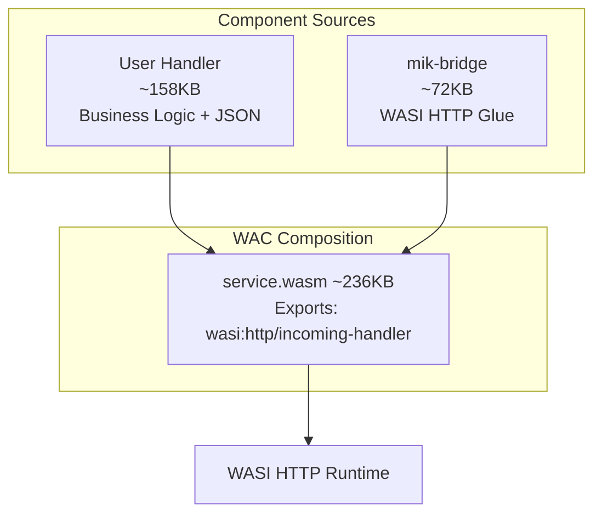

import { Card, CardGrid, LinkCard, Badge } from '@astrojs/starlight/components';

**Portable WASI HTTP SDK using Component Composition**

Write handlers once, run on any WASI-compliant runtime.

## What is mik-sdk?

mik-sdk provides an ergonomic way to build portable WebAssembly HTTP handlers in pure Rust. It uses a two-component architecture where your handler logic is composed with a bridge component that handles WASI HTTP translation.

```rust
use mik_sdk::prelude::*;

routes! {
    GET "/" => home,
    GET "/hello/{name}" => hello(path: HelloPath),
    POST "/users" => create_user(body: CreateInput),
}

fn home(_req: &Request) -> Response {
    ok!({ "message": "Welcome to mik-sdk!" })
}

fn hello(path: HelloPath, _req: &Request) -> Response {
    ok!({ "greeting": format!("Hello, {}!", path.name) })
}
```

## Key Features

<CardGrid>
  <Card title="Type-Safe Routing" icon="pencil">
    Define routes with automatic path, query, and body extraction using derive macros.
  </Card>
  <Card title="Pure Rust JSON" icon="document">
    Fast JSON parsing and building with lazy evaluation - no external calls.
  </Card>
  <Card title="Minimal Size" icon="rocket">
    Composed components are ~200KB - optimized for edge deployment.
  </Card>
  <Card title="Portable" icon="external">
    Run on any WASI HTTP runtime - build once, deploy anywhere.
  </Card>
</CardGrid>

## Architecture Overview

mik-sdk uses a two-component architecture for WASI HTTP portability:



| Component | Purpose | Size |
|-----------|---------|------|
| **Handler** | Your business logic + JSON/time/random | ~158KB |
| **Bridge** | WASI HTTP adapter | ~72KB |
| **Composed** | Complete service | ~230KB |

## Quick Links

<CardGrid>
  <LinkCard title="Installation" href="/guides/installation/" description="Set up your development environment" />
  <LinkCard title="Quick Start" href="/guides/quickstart/" description="Build your first handler in minutes" />
  <LinkCard title="Routing" href="/guides/routing/" description="Learn the routing system" />
  <LinkCard title="API Reference" href="/reference/quick-reference/" description="Complete API documentation" />
</CardGrid>

## Why mik-sdk?

### Ergonomic API

```rust
#[derive(Type)]
pub struct CreateUserInput {
    #[field(min = 1, max = 100)]
    pub name: String,
    #[field(format = "email")]
    pub email: String,
}

fn create_user(body: CreateUserInput, _req: &Request) -> Response {
    // body is already parsed and validated
    ok!({ "name": body.name, "email": body.email })
}
```

### Fast JSON Handling

Lazy JSON parsing extracts only the fields you need - up to 33x faster than full tree parsing:

```rust
let parsed = json::try_parse(body)?;
let name = parsed.path_str(&["user", "name"]);  // ~100ns
let age = parsed.path_int(&["user", "age"]);    // ~100ns
```

### Native WASI Integration

Uses native WASI interfaces automatically on WebAssembly:

- `wasi:clocks/wall-clock` for time
- `wasi:random/random` for cryptographic randomness
- `wasi:http/outgoing-handler` for HTTP client (optional)

### SQL Query Builder

Build parameterized SQL queries with Mongo-style filter syntax:

```rust
let (sql, params) = sql_read!(users {
    select: [id, name, email],
    filter: { active: true, age: { $gte: 18 } },
    order: [-created_at, id],
    limit: 20,
});
```

## Project Status

<Badge text="Experimental" variant="caution" />

mik-sdk is an experimental project for learning and internal use. It demonstrates WASI P2, WAC composition, and component model patterns.
