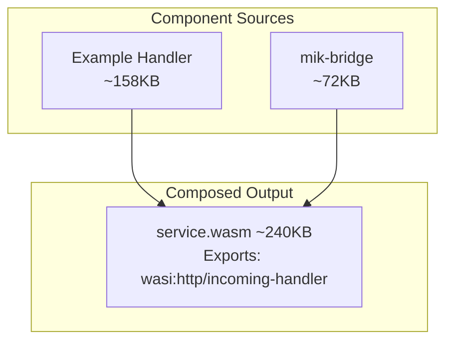

# mik-sdk Examples

Example projects demonstrating mik-sdk's WASI HTTP architecture.

## Quick Start

All examples follow the same build and composition pattern:

```bash
# Navigate to any example
cd examples/hello-world

# Build the handler component
cargo component build --release

# Compose with bridge
wac plug ../mik-bridge/target/wasm32-wasip1/release/mik_bridge.wasm \
    --plug target/wasm32-wasip1/release/hello_world.wasm \
    -o service.wasm

# Run with wasmtime
wasmtime serve -S cli=y service.wasm
```

---

## Example Index

### 1. hello-world
**Path:** `examples/hello-world/`
**Complexity:** Beginner

A minimal example demonstrating the core features of mik-sdk.

**What it demonstrates:**
- Route matching with the `routes!` macro
- Path parameters (`/hello/{name}`)
- Response macros (`ok!`, `error!`)
- JSON body parsing
- Two-component composition architecture

**Endpoints:**
- `GET /` - Welcome message with endpoint list
- `GET /hello/{name}` - Personalized greeting
- `POST /echo` - Echo request body

**Example:**
```rust
use mik_sdk::prelude::*;

routes! {
    GET "/" => home,
    GET "/hello/{name}" => hello,
    POST "/echo" => echo,
}

fn home(_req: &Request) -> Response {
    ok!({
        "message": "Welcome to mik-sdk!",
        "endpoints": ["/", "/hello/{name}", "/echo"]
    })
}

fn hello(req: &Request) -> Response {
    let name = req.param("name").unwrap_or("stranger");
    ok!({
        "greeting": format!("Hello, {}!", name),
        "name": name
    })
}
```

---

### 2. crud-api
**Path:** `examples/crud-api/`
**Complexity:** Intermediate

A complete REST API implementing CRUD operations.

**What it demonstrates:**
- Full REST API design (GET, POST, PUT, DELETE)
- Path parameters for resource IDs
- Query parameters for pagination
- JSON request/response handling
- Error handling patterns
- Validation patterns

**Endpoints:**
- `GET /items` - List items (with pagination)
- `GET /items/{id}` - Get item by ID
- `POST /items` - Create new item
- `PUT /items/{id}` - Update item
- `DELETE /items/{id}` - Delete item

---

### 3. auth-api
**Path:** `examples/auth-api/`
**Complexity:** Intermediate

Authentication patterns and protected routes.

**What it demonstrates:**
- API key / Bearer token authentication
- Protected routes with `guard!` macro
- Structured logging with `log!` macro
- Error handling patterns (Result-based auth)
- Token generation and validation patterns

**Endpoints:**
- `GET /` - API info (public)
- `GET /health` - Health check (public)
- `POST /login` - Login and get token (public)
- `GET /me` - Get user profile (protected)
- `GET /protected` - Access protected resource (protected)
- `POST /logout` - Logout (protected)

**Example usage:**
```bash
# Login
curl -X POST http://localhost:8080/login \
  -H "Content-Type: application/json" \
  -d '{"username":"alice","password":"password123"}'

# Access protected resource
curl http://localhost:8080/me \
  -H "Authorization: Bearer <token>"
```

---

## Architecture

Each example handler composes with the bridge component:



## Prerequisites

**Required:**
- Rust 1.89+
- `cargo-component` - `cargo install cargo-component`
- `wac-cli` - `cargo install wac-cli`
- `wasm32-wasip2` target - `rustup target add wasm32-wasip2`
- `wasmtime-cli` - `cargo install wasmtime-cli`

## Common Patterns

### Request Handling

```rust
fn handler(req: &Request) -> Response {
    // Path parameters (from route pattern)
    let id = req.param("id").unwrap_or("?");

    // Query parameters
    let page = req.query("page").unwrap_or("1");

    // JSON body
    if let Some(parsed) = req.json() {
        let name = parsed.path_str(&["name"]);
        // ...
    }

    ok!({ "id": id })
}
```

### Response Building

```rust
// Success with JSON
ok!({ "message": "Success", "data": value })

// Error macros
not_found!("Resource not found")
bad_request!("Invalid input")

// RFC 7807 Problem Details
error! {
    status: 422,
    title: "Validation Error",
    detail: "Invalid input"
}
```

## License

MIT OR Apache-2.0
