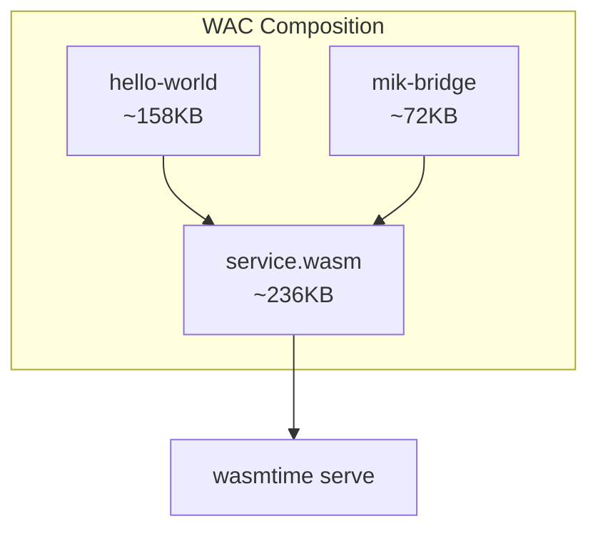

# Hello World Example

A minimal example demonstrating mik-sdk's component composition architecture.

## Overview

This example shows how to build a simple HTTP handler using mik-sdk's ergonomic API:

- **GET /** - Welcome message with available endpoints
- **GET /hello/{name}** - Personalized greeting
- **POST /echo** - Echo back request body

## Key Features Demonstrated

1. **Route Matching** - Routes defined with `routes!` macro
2. **Path Parameters** - Extract `{name}` from URL path
3. **Response Macros** - Use `ok!` and `error!` for clean response building
4. **JSON Parsing** - Parse request body with `req.json::<T>()`
5. **Component Composition** - Handler exports `mik:core/handler`, bridge imports it

## Project Structure

```
hello-world/
├── Cargo.toml         # Component configuration
├── src/
│   └── lib.rs         # Handler implementation
└── README.md          # This file
```

## Building

### Prerequisites

- Rust 1.75+ with `wasm32-wasip2` target
- `cargo-component` for building WASM components

```bash
# Install cargo-component if needed
cargo install cargo-component

# Add wasm32-wasip2 target
rustup target add wasm32-wasip2
```

### Build the Handler Component

```bash
cargo component build --release
```

This produces `target/wasm32-wasip2/release/hello_world.wasm`.

## Running

```bash
# Compose with bridge
wac plug mik-bridge.wasm --plug target/wasm32-wasip2/release/hello_world.wasm -o service.wasm

# Run with wasmtime
wasmtime serve -S cli=y service.wasm
```

## Testing the Endpoints

### GET /

```bash
curl http://localhost:3000/
```

Response:
```json
{
  "data": {
    "message": "Welcome to mik-sdk!",
    "version": "0.2.0",
    "endpoints": [
      "/",
      "/hello/{name}",
      "/echo"
    ]
  }
}
```

### GET /hello/{name}

```bash
curl http://localhost:3000/hello/Alice
```

Response:
```json
{
  "data": {
    "greeting": "Hello, Alice!",
    "name": "Alice"
  }
}
```

### POST /echo

```bash
curl -X POST http://localhost:3000/echo \
  -H "Content-Type: application/json" \
  -d '{"message": "Hello mik-sdk!"}'
```

Response:
```json
{
  "data": {
    "echo": "Hello mik-sdk!",
    "length": 15
  }
}
```

## Code Walkthrough

### Handler Implementation

```rust
impl Guest for HelloWorld {
    fn handle(req: Request) -> Response {
        // Router has already matched the route
        let response = match req.route.as_str() {
            "home" => handle_home(),
            "hello" => handle_hello(&req),
            "echo" => handle_echo(&req),
            _ => error!("NOT_FOUND", "Route not found"),
        };

        // Convert to WIT Response type
        let http_response = response.to_http_response();
        Response {
            status: http_response.status,
            headers: http_response.headers,
            body: http_response.body,
        }
    }
}
```

### Using Response Macros

```rust
// Success response with JSON literal
ok!({
    "message": "Welcome!",
    "data": value
})

// Error response with code and message
error!("NOT_FOUND", "Resource not found")

// Serialize typed struct
ok!(json!(typed_struct))
```

### Extracting Request Data

```rust
// Path parameter
let name = req.param_or("name", "default");

// Query parameter
let page = req.query_or("page", "1");

// Parse JSON body
let data: MyType = req.json()?;

// Raw body bytes
let bytes = req.body_bytes();
```

## Architecture



## What's Next?

- Explore validation with external crates like `garde`
- Build more complex handlers with database access via sidecars

## Learn More

- [mik-sdk Documentation](../../README.md)
- [Component Model](https://component-model.bytecodealliance.org/)
- [WASI Preview 2](https://github.com/WebAssembly/WASI/blob/main/preview2/README.md)
